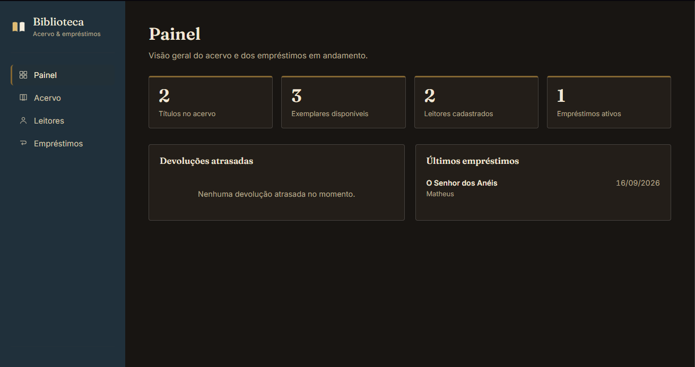
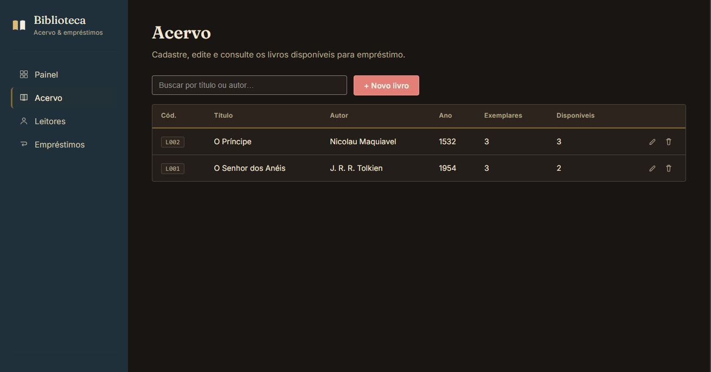
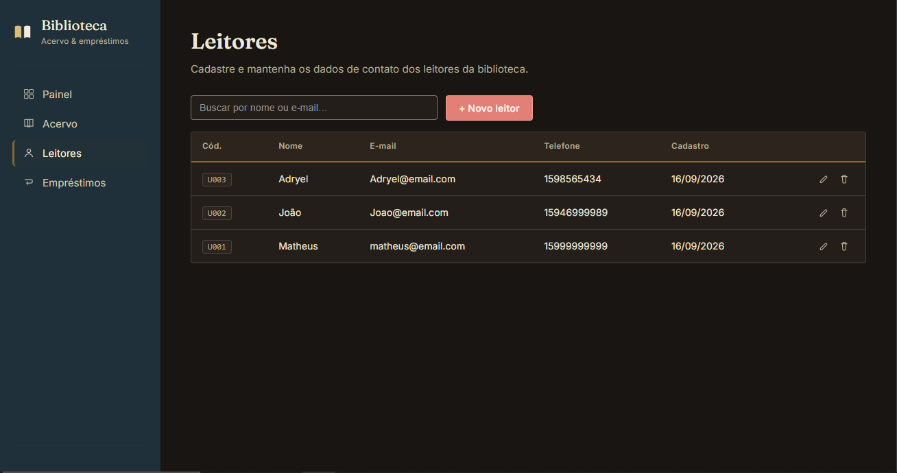
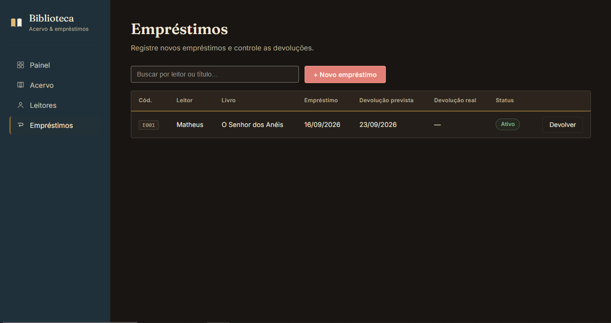

# sistema-biblioteca-np1

Projeto de Banco de Dados NP1 - Sistema de Biblioteca com CRUD.

1. Identificação Institucional
* Curso: Ciência da Computação
* Integrantes:
* Nome: Adryel Miranda da silva - RA: R803Fj8 - Turma:CC4P17
* Nome: Matheus dos Santos Ribeiro Aguiar - RA: H785480 - Turma:CC3P17
* Nome: Gabriel Barbosa Rodrigues - RA: R852HH7 - Turma: CC4P17
* Nome: Guilherme Cares Oliveira - RA: R856585 - Turma: CC4P17
2. Descrição do Projeto

Tema: Sistema de Gerenciamento de Biblioteca (Controle de Usuários, Livros e Empréstimos).
Regras de Negócio e Escopo Funcional:
O sistema permite o cadastro completo de usuários, controle do acervo de livros disponíveis e o registro de empréstimos e devoluções.
Cada empréstimo está vinculado obrigatoriamente a um usuário cadastrado e a um livro existente no acervo.
O controle de estoque (quantidade de livros) é atualizado de acordo com a disponibilidade das obras.

3. Modelagem de Dados

Diagrama Entidade-Relacionamento (DER)
Abaixo está o DER que ilustra o relacionamento conceitual e lógico entre as entidades `USUARIO`, `LIVRO` e `EMPRESTIMO`:


Scripts DDL

```sql
-- ==========================================================
-- SCRIPT DDL - SISTEMA DE BIBLIOTECA
-- Descrição: Criação do banco de dados e tabelas relacionais
-- ==========================================================

-- Criação do banco de dados
CREATE DATABASE BibliotecaDB;
GO

-- Seleciona o banco que será utilizado para as próximas operações
USE BibliotecaDB;
GO

-- ------------------------------------------------------------
-- Tabela: LIVRO
-- Armazena o acervo e o controle de quantidade de exemplares
-- ----------------------------------------------------------
CREATE TABLE LIVRO (
    id\_livro INT IDENTITY(1,1) PRIMARY KEY,        -- Identificador único do livro (Chave Primária autoincrementável)
    titulo VARCHAR(150) NOT NULL,                  -- Título da obra (obrigatório)
    autor VARCHAR(100) NOT NULL,                   -- Nome do autor da obra (obrigatório)
    ano\_publicacao INT,                            -- Ano em que o livro foi publicado
    quantidade\_total INT NOT NULL,                 -- Quantidade total de exemplares adquiridos pela biblioteca
    quantidade\_disponivel INT NOT NULL,            -- Quantidade de exemplares disponíveis atualmente para empréstimo

    -- Restrição para garantir consistência nas quantidades (não podem ser negativas e a disponível não pode superar a total)
    CONSTRAINT CK\_LIVRO\_QUANTIDADE
        CHECK (
            quantidade\_total >= 0
            AND quantidade\_disponivel >= 0
            AND quantidade\_disponivel <= quantidade\_total
        )
);
GO

-- ------------------------------------------------------------
-- Tabela: USUARIO
-- Armazena os dados cadastrais dos usuários da biblioteca
-- ----------------------------------------------------------
CREATE TABLE USUARIO (
    id\_usuario INT IDENTITY(1,1) PRIMARY KEY,      -- Identificador único do usuário (Chave Primária autoincrementável)
    nome VARCHAR(100) NOT NULL,                    -- Nome completo do usuário (obrigatório)
    email VARCHAR(100) NOT NULL UNIQUE,            -- E-mail de contato do usuário (obrigatório e único no sistema)
    telefone VARCHAR(20),                          -- Telefone de contato do usuário
    data\_cadastro DATE NOT NULL DEFAULT GETDATE()  -- Data de cadastro do usuário (preenchida automaticamente com a data atual)
);
GO

-- ------------------------------------------------------------
-- Tabela: EMPRESTIMO
-- Registra as transações de empréstimos de livros aos usuários
-- ----------------------------------------------------------
CREATE TABLE EMPRESTIMO (
    id\_emprestimo INT IDENTITY(1,1) PRIMARY KEY,   -- Identificador único do empréstimo (Chave Primária autoincrementável)
    id\_usuario INT NOT NULL,                       -- Chave estrangeira que referencia o usuário que realizou o empréstimo
    id\_livro INT NOT NULL,                         -- Chave estrangeira que referencia o livro emprestado
    data\_emprestimo DATE NOT NULL DEFAULT GETDATE(), -- Data em que o livro foi retirado (padrão: data atual)
    data\_devolucao\_prevista DATE NOT NULL,         -- Data limite estipulada para a devolução do livro
    data\_devolucao\_real DATE NULL,                 -- Data em que o livro foi efetivamente devolvido (nulo se ainda estiver emprestado)
    status VARCHAR(20) NOT NULL DEFAULT 'Emprestado', -- Status atual do empréstimo ('Emprestado' ou 'Devolvido')

    -- Restrição de Integridade Referencial para Usuário (garante que o usuário existe)
    CONSTRAINT FK\_EMPRESTIMO\_USUARIO
        FOREIGN KEY (id\_usuario)
        REFERENCES USUARIO(id\_usuario),

    -- Restrição de Integridade Referencial para Livro (garante que o livro existe)
    CONSTRAINT FK\_EMPRESTIMO\_LIVRO
        FOREIGN KEY (id\_livro)
        REFERENCES LIVRO(id\_livro),

    -- Restrição para garantir que o status aceite apenas valores permitidos
    CONSTRAINT CK\_EMPRESTIMO\_STATUS
        CHECK (status IN ('Emprestado', 'Devolvido'))
);
GO
```

4. Guia de Instalação e Execução

Este projeto utiliza:

* Java 17
* NetBeans
* Maven
* Microsoft SQL Server
\*JDBC Driver da Microsoft
\*Autenticação do Windows

O projeto foi desenvolvido para acessar um banco de dados chamado:
BibliotecaDB

Instalar o Java
É necessário ter o Java instalado.
Recomendado:
Java 17

Para verificar se o Java já está instalado, abra o Prompt de Comando e execute:

```text
java -version
```

Deve aparecer algo semelhante a:
java version "17"

2. Instalar o NetBeans

Instale o Apache NetBeans.

Depois abra normalmente o NetBeans.

O projeto utiliza Maven, então o NetBeans deve reconhecer automaticamente o arquivo:
pom.xml

Instalar o Microsoft SQL Server

É necessário instalar o Microsoft SQL Server.

Durante a instalação, certifique-se de permitir o uso de:

Windows Authentication

A autenticação do sistema utiliza a própria conta do Windows da pessoa que estiver executando o projeto.

Por exemplo:

DESKTOP-123ABC\\Joao
ou
NOTEBOOK\\Maria

4. Instalar o SQL Server Management Studio

Também é recomendado instalar o:
SQL Server Management Studio

conhecido como: SSMS

Ele será utilizado para criar e visualizar o banco de dados.

Depois de instalar, abra o SSMS.
Conectar ao SQL Server usando Windows Authentication

Ao abrir o SQL Server Management Studio, aparecerá a tela de conexão.

Em:
Authentication

selecione:
Windows Authentication

Depois clique em:
Connect

Se a conexão funcionar, significa que a conta do Windows possui acesso ao SQL Server.

6. Criar o banco BibliotecaDB

No SQL Server Management Studio, clique em:
New Query

Execute:

```
CREATE DATABASE BibliotecaDB;
GO
```

Depois:

```
USE BibliotecaDB;
GO
```

7. Criar a tabela LIVRO

Execute:

```
CREATE TABLE LIVRO (
    id\_livro INT IDENTITY(1,1) PRIMARY KEY,
    titulo VARCHAR(150) NOT NULL,
    autor VARCHAR(100) NOT NULL,
    ano\_publicacao INT,
    quantidade\_total INT NOT NULL,
    quantidade\_disponivel INT NOT NULL,

    CONSTRAINT CK\_LIVRO\_QUANTIDADE
        CHECK (
            quantidade\_total >= 0
            AND quantidade\_disponivel >= 0
            AND quantidade\_disponivel <= quantidade\_total
        )
);
GO
```

8. Criar a tabela USUARIO

Execute:

```
CREATE TABLE USUARIO (
    id\_usuario INT IDENTITY(1,1) PRIMARY KEY,
    nome VARCHAR(100) NOT NULL,
    email VARCHAR(100) NOT NULL UNIQUE,
    telefone VARCHAR(20),
    data\_cadastro DATE NOT NULL DEFAULT GETDATE()
);
GO
```

9. Criar a tabela EMPRESTIMO

Execute:

```
CREATE TABLE EMPRESTIMO (
    id\_emprestimo INT IDENTITY(1,1) PRIMARY KEY,

    id\_usuario INT NOT NULL,
    id\_livro INT NOT NULL,

    data\_emprestimo DATE NOT NULL DEFAULT GETDATE(),
    data\_devolucao\_prevista DATE NOT NULL,
    data\_devolucao\_real DATE NULL,

    status VARCHAR(20) NOT NULL DEFAULT 'Emprestado',

    CONSTRAINT FK\_EMPRESTIMO\_USUARIO
        FOREIGN KEY (id\_usuario)
        REFERENCES USUARIO(id\_usuario),

    CONSTRAINT FK\_EMPRESTIMO\_LIVRO
        FOREIGN KEY (id\_livro)
        REFERENCES LIVRO(id\_livro),

    CONSTRAINT CK\_EMPRESTIMO\_STATUS
        CHECK (status IN ('Emprestado', 'Devolvido'))
);
GO
```

10. Conferir se as tabelas foram criadas

Execute:

```
SELECT \* FROM LIVRO;
SELECT \* FROM USUARIO;
SELECT \* FROM EMPRESTIMO;
```

Se não aparecer erro, o banco foi criado corretamente.

11. Verificar se o SQL Server está usando TCP/IP

O projeto utiliza uma conexão semelhante a:

jdbc:sqlserver://localhost:1433;

Por isso, o SQL Server precisa aceitar conexão TCP/IP.

Abra:
SQL Server Configuration Manager

Procure:
SQL Server Network Configuration

Depois:
Protocols for MSSQLSERVER

ou algo semelhante ao nome da instância instalada.

Verifique se:
TCP/IP

está como:
Enabled

Caso esteja desabilitado:
Clique com o botão direito.
Clique em Enable.
Reinicie o serviço do SQL Server.

12. Verificar a porta 1433

Abra novamente:
SQL Server Configuration Manager

Vá em:
SQL Server Network Configuration

Depois:
Protocols for MSSQLSERVER

Clique duas vezes em:
TCP/IP

Abra a aba:
IP Addresses

Procure:
IPAll

Em:
TCP Port

deixe:
1433

Se existir valor em:
TCP Dynamic Ports
pode ser necessário apagar esse valor.

Depois reinicie o SQL Server.

13. Baixar o JDBC Driver da Microsoft

O projeto utiliza o JDBC Driver da Microsoft para conectar o Java ao SQL Server.

Baixe o:
Microsoft JDBC Driver for SQL Server

O projeto utiliza uma versão compatível com Java 11 ou superior.

Por exemplo:

mssql-jdbc 13.4.0.jre11

No Maven, a dependência é:

<dependency>
    <groupId>com.microsoft.sqlserver</groupId>
    <artifactId>mssql-jdbc</artifactId>
    <version>13.4.0.jre11</version>
</dependency>

Como o projeto utiliza Maven, normalmente o arquivo .jar será baixado automaticamente.

Porém, para a autenticação do Windows, também será necessária a DLL nativa.

14. Localizar a DLL de autenticação do Windows

Dentro da pasta do JDBC baixado, procure uma estrutura semelhante a:

sqljdbc\_13.4

Depois:
auth

Depois:
x64

Dentro dessa pasta deverá existir um arquivo semelhante a:
mssql-jdbc\_auth-13.4.0.x64.dll

Por exemplo, no computador original do projeto o caminho ficou parecido com:
C:\\sqljdbc\_13.4.0.0\_ptb\\sqljdbc\_13.4\\ptb\\auth\\x64

No computador de outra pessoa provavelmente será diferente.

15. Configurar o caminho da DLL no NetBeans

Abra o projeto no NetBeans.

Clique com o botão direito no projeto:

BibliotecaDb

Depois:
Properties

Procure:
Run

Em:
VM Options

adicione:
-Djava.library.path=CAMINHO\_DA\_PASTA\_AUTH\_X64

Por exemplo:
-Djava.library.path=C:\\sqljdbc\_13.4.0.0\_ptb\\sqljdbc\_13.4\\ptb\\auth\\x64

É importante colocar apenas a pasta.

Não coloque o nome do arquivo .dll.

Correto:
C:\\sqljdbc\_13.4.0.0\_ptb\\sqljdbc\_13.4\\ptb\\auth\\x64

Evite:
C:\\sqljdbc\_13.4.0.0\_ptb\\sqljdbc\_13.4\\ptb\\auth\\x64\\mssql-jdbc\_auth.dll
16. VM Options recomendadas

Pode utilizar:
-Djava.library.path=C:\\CAMINHO\\DO\\JDBC\\auth\\x64 -Dfile.encoding=UTF-8 --enable-native-access=ALL-UNNAMED

A pessoa deverá substituir:
C:\\CAMINHO\\DO\\JDBC\\auth\\x64

pelo caminho real no computador dela.
O:

\-Dfile.encoding=UTF-8

ajuda com caracteres como:
á
ã
é
ç

O:
--enable-native-access=ALL-UNNAMED

pode evitar alguns avisos relacionados ao acesso nativo nas versões mais recentes do Java.

17. Verificar a classe Conexao

O projeto utiliza uma conexão parecida com:

```
private static final String URL =
        "jdbc:sqlserver://localhost:1433;"
        + "databaseName=BibliotecaDB;"
        + "integratedSecurity=true;"
        + "encrypt=true;"
        + "trustServerCertificate=true;";
```

Essa configuração significa:
localhost

O banco está no próprio computador.

1433

Porta utilizada pelo SQL Server.

databaseName=BibliotecaDB

Nome do banco.

integratedSecurity=true

Utiliza a conta do Windows.

encrypt=true

Utiliza conexão criptografada.

trustServerCertificate=true

Permite confiar no certificado local do SQL Server.

18. A autenticação funciona com outro usuário do Windows?

Sim.

A outra pessoa não precisa utilizar a sua conta do Windows.

Se no computador dela a conta for:

DESKTOP-ABC\\Maria

o Java utilizará:

DESKTOP-ABC\\Maria

Se for:
NOTEBOOK-JOAO\\Joao

o Java utilizará:
NOTEBOOK-JOAO\\Joao

Isso acontece por causa de:

integratedSecurity=true;
19. O usuário Windows precisa ter acesso ao SQL Server

A pessoa deve conseguir abrir o SSMS utilizando:

Windows Authentication

Se ela consegue conectar ao SQL Server dessa forma e criar/acessar o banco:

BibliotecaDB

há uma grande chance de o Java conseguir utilizar a mesma autenticação.

O Java não está usando uma senha que foi colocada no código.

Ele está usando a autenticação do próprio Windows.

20. Abrir o projeto no NetBeans

Depois de configurar o banco:

Abra o NetBeans.
Clique em:
File
Depois:
Open Project
Selecione a pasta:
BibliotecaDb

O NetBeans deverá reconhecer que é um projeto Maven.

21. Aguardar o Maven baixar as dependências

Na primeira vez que o projeto for aberto, o Maven pode baixar várias dependências.

É necessário estar conectado à internet.

Entre elas estará:

mssql-jdbc

Não interrompa o download.

22. Verificar o pom.xml

O arquivo:

pom.xml

deverá conter algo parecido com:

<dependencies>

&#x20;   <dependency>
        <groupId>com.microsoft.sqlserver</groupId>
        <artifactId>mssql-jdbc</artifactId>
        <version>13.4.0.jre11</version>
    </dependency>


</dependencies>
23. Executar o programa

Depois:
Run Project

ou pressione:
F6

Se estiver tudo configurado corretamente, deverá aparecer algo parecido com:

Conexão realizada com sucesso!
24. Testar o cadastro de livro

Por exemplo:

```
Livro livro = new Livro(
        "O Senhor dos Anéis",
        "J. R. R. Tolkien",
        1954,
        3,
        3
);
```

```
LivroDao livroDao = new LivroDao();

livroDao.cadastrar(livro);
```

Depois consulte:

```
SELECT \* FROM LIVRO;
```

Deverá aparecer o livro cadastrado.

25. Testar o cadastro de usuário

Por exemplo:

```
Usuario usuario = new Usuario(
        "Matheus",
        "matheus@email.com",
        "15999999999"
);
```

```
UsuarioDao usuarioDao = new UsuarioDao();

usuarioDao.cadastrar(usuario);
```

Depois:

```
SELECT \* FROM USUARIO;
```

26. Testar empréstimo

Depois de existir pelo menos:

1 usuário
1 livro

é possível realizar um empréstimo.

Por exemplo:

```
Emprestimo emprestimo = new Emprestimo(
        1,
        1,
        LocalDate.now().plusDays(7)
);

EmprestimoDao emprestimoDao = new EmprestimoDao();

emprestimoDao.realizarEmprestimo(emprestimo);
```

Depois consulte:

```
SELECT \* FROM EMPRESTIMO;
```

E:

```
SELECT \* FROM LIVRO;
```

A quantidade disponível deverá diminuir.

Por exemplo:

Antes:
quantidade\_disponivel = 3

Depois do empréstimo:

quantidade\_disponivel = 2
27. Testar devolução

Por exemplo:

```
emprestimoDao.devolverLivro(1);
```

Depois:

```
SELECT \* FROM EMPRESTIMO;
```

O status deverá ficar:

Devolvido

E:

data\_devolucao\_real

deverá receber a data da devolução.

Além disso:

```
SELECT \* FROM LIVRO;
```

deverá mostrar novamente:

quantidade\_disponivel = 3

28. Problema: Login failed

Se aparecer algo relacionado a:

Login failed

ou:

Integrated authentication failed

verifique primeiro se consegue entrar no SSMS usando:
Windows Authentication

Se não conseguir, o problema está na configuração ou nas permissões do SQL Server.

29. Problema: DLL não encontrada

Se aparecer algo parecido com:
This driver is not configured for integrated authentication

ou:
Unable to load mssql-jdbc\_auth

o problema provavelmente está no caminho:
-Djava.library.path

Confira novamente onde está a pasta:
auth\\x64

30. Problema: conexão recusada na porta 1433

Se aparecer:
Connection refused

ou erro semelhante de TCP/IP, verifique:
TCP/IP habilitado

e:
porta 1433

Também verifique se o serviço:
SQL Server
está iniciado.

31. Problema: localhost não funciona

Em algumas instalações, o SQL Server pode estar utilizando uma instância diferente.

Por exemplo:
SQLEXPRESS

Nesse caso, dependendo da configuração, pode ser necessário ajustar a conexão.

Por exemplo:

```
jdbc:sqlserver://localhost;
instanceName=SQLEXPRESS;
databaseName=BibliotecaDB;
integratedSecurity=true;
```

Porém, para facilitar a entrega do trabalho, o recomendado é configurar o SQL Server para utilizar:

localhost:1433

32. Estrutura recomendada para entregar o trabalho

A pasta do projeto poderia ficar assim:

\*BibliotecaDb/

* │
* ├── src/
* │   └── main/
* │       └── java/
* │
* ├── database/
* │   └── BibliotecaDB.sql
* │
* ├── pom.xml
* │
* └── README.txt

No arquivo:
BibliotecaDB.sql

coloque:

```
CREATE DATABASE BibliotecaDB;
GO

USE BibliotecaDB;
GO

CREATE TABLE LIVRO (
    id\_livro INT IDENTITY(1,1) PRIMARY KEY,
    titulo VARCHAR(150) NOT NULL,
    autor VARCHAR(100) NOT NULL,
    ano\_publicacao INT,
    quantidade\_total INT NOT NULL,
    quantidade\_disponivel INT NOT NULL,

    CONSTRAINT CK\_LIVRO\_QUANTIDADE
        CHECK (
            quantidade\_total >= 0
            AND quantidade\_disponivel >= 0
            AND quantidade\_disponivel <= quantidade\_total
        )
);
GO

CREATE TABLE USUARIO (
    id\_usuario INT IDENTITY(1,1) PRIMARY KEY,
    nome VARCHAR(100) NOT NULL,
    email VARCHAR(100) NOT NULL UNIQUE,
    telefone VARCHAR(20),
    data\_cadastro DATE NOT NULL DEFAULT GETDATE()
);
GO

CREATE TABLE EMPRESTIMO (
    id\_emprestimo INT IDENTITY(1,1) PRIMARY KEY,

    id\_usuario INT NOT NULL,
    id\_livro INT NOT NULL,

    data\_emprestimo DATE NOT NULL DEFAULT GETDATE(),
    data\_devolucao\_prevista DATE NOT NULL,
    data\_devolucao\_real DATE NULL,

    status VARCHAR(20) NOT NULL DEFAULT 'Emprestado',

    CONSTRAINT FK\_EMPRESTIMO\_USUARIO
        FOREIGN KEY (id\_usuario)
        REFERENCES USUARIO(id\_usuario),

    CONSTRAINT FK\_EMPRESTIMO\_LIVRO
        FOREIGN KEY (id\_livro)
        REFERENCES LIVRO(id\_livro),

    CONSTRAINT CK\_EMPRESTIMO\_STATUS
        CHECK (status IN ('Emprestado', 'Devolvido'))
);
GO
```

Assim o outro aluno não precisa criar cada tabela manualmente.

Ele apenas executa o arquivo SQL.

Resumo rápido para quem for testar

No começo do README você pode colocar este resumo:

PASSOS PARA EXECUTAR O PROJETO

1. Instalar Java 17.
2. Instalar NetBeans.
3. Instalar Microsoft SQL Server.
4. Instalar SQL Server Management Studio.
5. Conectar ao SQL Server usando Windows Authentication.
6. Executar o arquivo database/BibliotecaDB.sql.
7. Certificar-se de que o SQL Server está utilizando TCP/IP e porta 1433.
8. Baixar o Microsoft JDBC Driver.
9. Localizar a pasta auth\\x64 do JDBC.
10. Configurar no NetBeans:

\-Djava.library.path=CAMINHO\_DO\_JDBC\\auth\\x64

11. Abrir o projeto BibliotecaDb no NetBeans.
12. Aguardar o Maven baixar as dependências.
13. Executar o projeto.
Acesso ao Sistema
Após iniciar o projeto pelo NetBeans, o servidor será executado localmente na porta 8080.

Para acessar a interface do Sistema de Biblioteca, abra o navegador e acesse:

http://localhost:8080/

> Importante: o programa Java deve estar em execução para que o site funcione, pois o servidor HTTP e a comunicação com o banco de dados são realizados pelo back-end Java.
Servidor HTTP

O projeto utiliza a classe HttpServer, disponível no pacote com.sun.net.httpserver do próprio JDK, para permitir a comunicação entre a interface web e o back-end Java.

O HttpServer não é um framework de desenvolvimento, como Spring Boot, Jakarta EE ou outros frameworks web. Ele é uma API fornecida pelo próprio Java/JDK para criação de um servidor HTTP simples.

Neste projeto, as rotas HTTP, o tratamento das requisições, as validações, a conversão dos dados e as respostas são implementadas manualmente no código Java. Da mesma forma, o acesso ao SQL Server é realizado diretamente por meio de JDBC e PreparedStatement, sem utilização de ORM ou framework de persistência.

Assim, o HttpServer é utilizado somente como recurso nativo do Java para receber e responder requisições HTTP, enquanto toda a lógica da aplicação e o acesso ao banco de dados foram implementados diretamente no projeto.

5. Evidências Visuais
Esta seção apresenta as capturas de tela (prints) que demonstram o funcionamento da interface do sistema, a execução das operações de CRUD e a persistência dos dados no banco de dados.

Figura 1 — Tela Inicial / Dashboard do Sistema

Descrição: Visão geral da interface principal da aplicação web da biblioteca, exibindo o painel de controle com os indicadores consolidados de acervo, leitores cadastrados e empréstimos ativos em andamento.

Figura 2 — Gestão do Acervo

Descrição: Interface de listagem de livros. Exibe os títulos cadastrados, seus autores, quantidade de exemplares totais e disponíveis, além de disponibilizar barra de busca e botões para criar, editar e excluir registros.

Figura 3 — Gestão de Leitores

Descrição: Tela de controle de usuários. Lista os leitores cadastrados com seus respectivos dados de contato e data de cadastro, permitindo a busca, inserção, atualização e exclusão de perfis.

Figura 4 — Controle de Empréstimos

Descrição: Interface para registro e monitoramento de empréstimos. Demonstra o vínculo entre um leitor e um livro, acompanhando as datas de retirada, devolução prevista e o status atual da transação.

Figura 5 — Registros no Banco de Dados

Descrição: Consulta executada diretamente no gerenciador do banco de dados, comprovando que as informações manipuladas pela interface web (CRUD) estão sendo persistidas e armazenadas corretamente nas tabelas do sistema.

